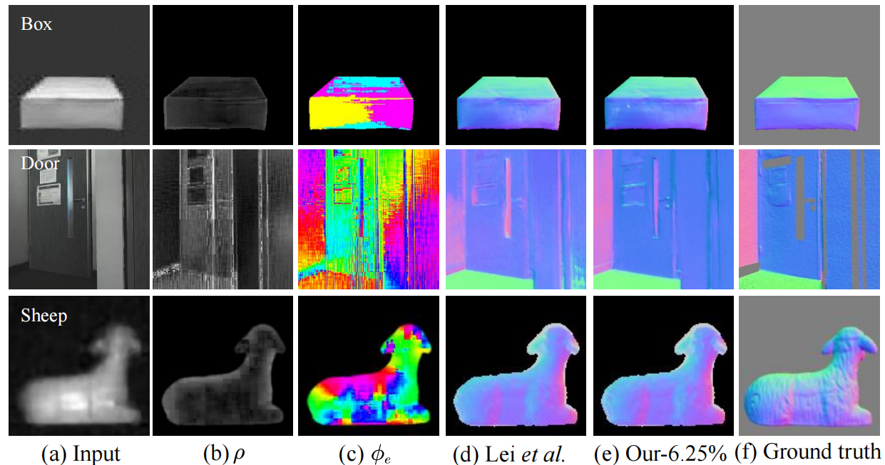

# HyCGA-Transformer
Implementation for Shape from polarization via ultra-low-sampling single-pixel imaging with decoupled spatial and polarimetric dimensions

# Introduction
This study pioneers the integration of the deep undersampling advantage of single-pixel imaging (SPI) with SfP technology, proposing a SPI ultra-low-sampling SfP architecture based on decoupled spatial and polarimetric dimensions.
 
# Dependencies and Installation
## Envitonment
Environment This code is based on PyTorch. It has been tested on Ubuntu 22.04.

```python
conda env create -f environment.yml
conda activate VITPhase
```

# Data
## Simulation dataset
### DeepSfP
### SPW
### Real-world scene datasets
# Train and test
```python
bash configs/train.sh
```


